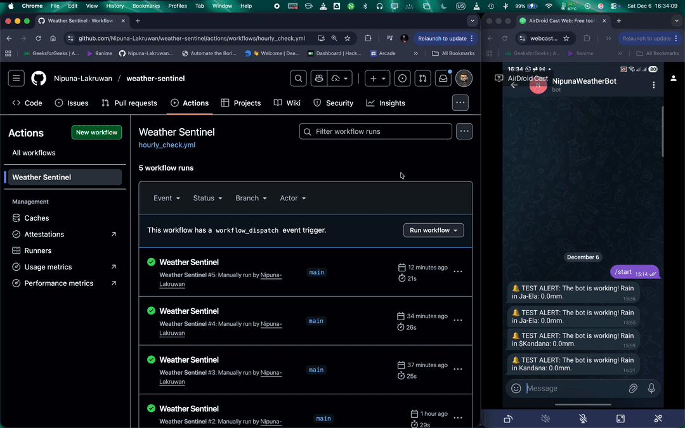

# 🌦️ Weather Sentinel (Automated DevOps Bot)


**A cloud-native, automated weather monitoring system designed to optimize daily commuting and schedule planning.**

---

## 📖 The Story: Why I Built This

As an IT undergraduate in Sri Lanka, unpredictable weather often disrupts my daily schedule and commuting plans.

I needed a solution that was **proactive**, not reactive. Inspired by the open-source "Digital Public Infrastructure" work of **Nuwan I. Senaratna** @nuuuwan (specifically repositories like `lk_dmc` and `weather_lk`), I engineered this automated bot to act as a sentinel for my home base in **Kandana**, ensuring I am alerted to weather changes before I start my day.

## 🚀 Key Features

* **Hyper-Local Monitoring:** Checks real-time weather specifically for **Kandana** (Home) and **Negombo** (Campus).
* **Smart Alerting:** Sends a push notification via Telegram ONLY when rain intensity exceeds specific thresholds (currently configured for testing).
* **Containerized:** Fully Dockerized application for portability across any cloud environment.
* **Serverless Automation:** Uses **GitHub Actions Cron Jobs** to run checks automatically every 4 hours without needing a dedicated 24/7 server.

---

## 🚀 Demo
Here is the Weather Sentinel in action. It triggers a workflow manually and instantly notifies my Telegram bot.



---

## 🛠️ Architecture & Tech Stack

This project bridges the gap between **Software Development** and **DevOps Engineering**.

| Component | Technology | Role |
| :--- | :--- | :--- |
| **Language** | Python 3.9 | Core logic, API requests, and data processing. |
| **Data Source** | Open-Meteo API | Provides free, high-precision weather data. |
| **Containerization** | Docker | Ensures the app runs identically on my laptop and the cloud. |
| **CI/CD** | GitHub Actions | Orchestrates the scheduled runs (Crontab: `0 */4 * * *`). |
| **Notifications** | Telegram Bot API | Delivers real-time mobile alerts. |

---

## ⚙️ Configuration & Setup

### 1. Prerequisites

* Python 3.x
* Docker (optional, for container testing)
* A Telegram Bot Token (from @BotFather)

### 2. Environment Variables

For security, credentials are **never** hardcoded. They are injected at runtime via Environment Variables:

| Variable | Description |
| :--- | :--- |
| `BOT_TOKEN` | Your Telegram bot token from @BotFather. |
| `CHAT_ID` | The unique ID of the user (or group) receiving the alerts. |

### 3. Local Installation

To run this project on your local machine:

```bash
# Clone the repository
git clone https://github.com/Nipuna-Lakruwan/weather-sentinel.git
cd weather-sentinel

# Install dependencies
pip install -r requirements.txt

# Export Keys (Mac/Linux)
export BOT_TOKEN="your_token_here"
export CHAT_ID="your_id_here"

# Run the script
python main.py
```

### 4\. Docker Usage

To build and run the container locally:

```bash
# Build the image
docker build -t weather-sentinel .

# Run the container (passing secrets)
docker run -e BOT_TOKEN="your_token" -e CHAT_ID="your_id" weather-sentinel
```

-----

## 📂 Project Structure

```text
weather-sentinel/
├── .github/
│   └── workflows/
│       └── hourly_check.yml  # The CI/CD Pipeline definition
├── main.py                   # The application logic
├── Dockerfile                # Instructions to build the container
├── requirements.txt          # Python dependencies (requests)
└── README.md                 # Project documentation
```

## 🧠 Code Highlight: Logic

The bot currently operates in **Test Mode** to demonstrate connectivity. In production, uncomment the threshold logic in `main.py` to reduce noise:

```python
# Production Logic (Silent unless critical)
if total_precip > 0.5:
    msg = f"⚠️ WEATHER ALERT: Rain detected in {city} area! ({total_precip}mm)"
    send_telegram_alert(msg)
    print("Alert sent!")
else:
    print("Weather looks clear. No alert needed.")
```

The threshold of **0.5mm** can be adjusted based on your sensitivity preferences.

## 🤝 Credits & Inspiration

* **Nuwan I. Senaratna (@nuuuwan):** For his extensive work on repositories like `lk_dmc` and `weather_lk`, which inspired the concept of structuring public data for utility.
* **Open-Meteo:** For providing an excellent free API for weather data.

---

## 📬 Contact

**Nipuna Lakruwan**
* GitHub: [@Nipuna-Lakruwan](https://github.com/Nipuna-Lakruwan)
* Repository: [weather-sentinel](https://github.com/Nipuna-Lakruwan/weather-sentinel)

---

*Built with ❤️ in Sri Lanka*
